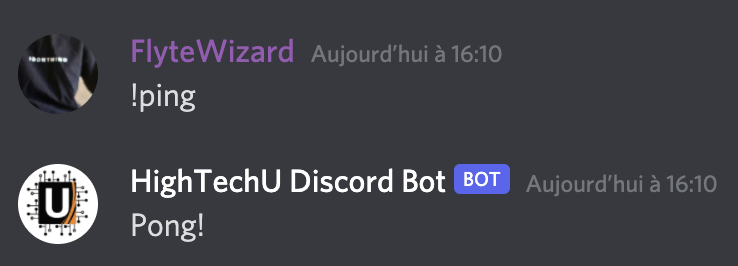

## About

Lorem ipsum dolor sit amet, consectetur adipiscing elit, sed do eiusmod tempor incididunt ut labore et dolore magna aliqua. Tortor vitae purus faucibus ornare suspendisse sed nisi lacus. Posuere lorem ipsum dolor sit. Quis varius quam quisque id diam vel quam elementum pulvinar. Rhoncus dolor purus non enim praesent elementum facilisis leo. Accumsan lacus vel facilisis volutpat est velit egestas dui. For more information about the commands visit the "[documentation](https://hightechu.ca)".

## Screenshots

## Technologies

The HighTechU Discord Bot uses the following technologies: Discord.js, Node.js, Firebase, Heroku, Bootstrap, and GitHub Pages.

## License

The project uses the [MIT LICENSE](https://choosealicense.com/licenses/mit/).

## Authors

- Navkaran
- Leo
- Makiho
- Tiffany
